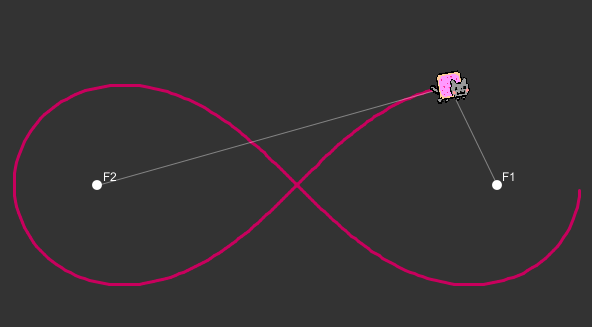
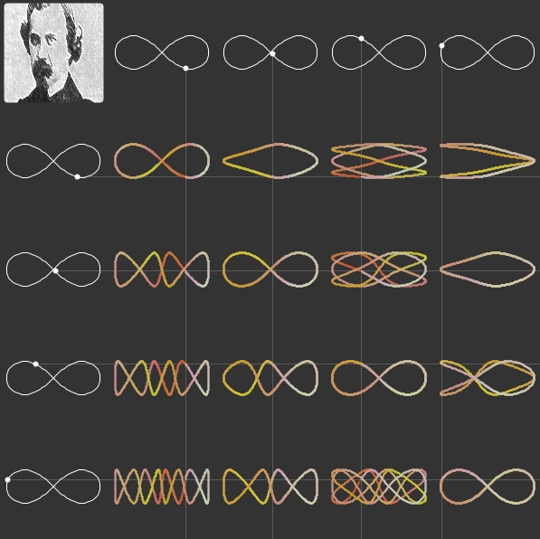
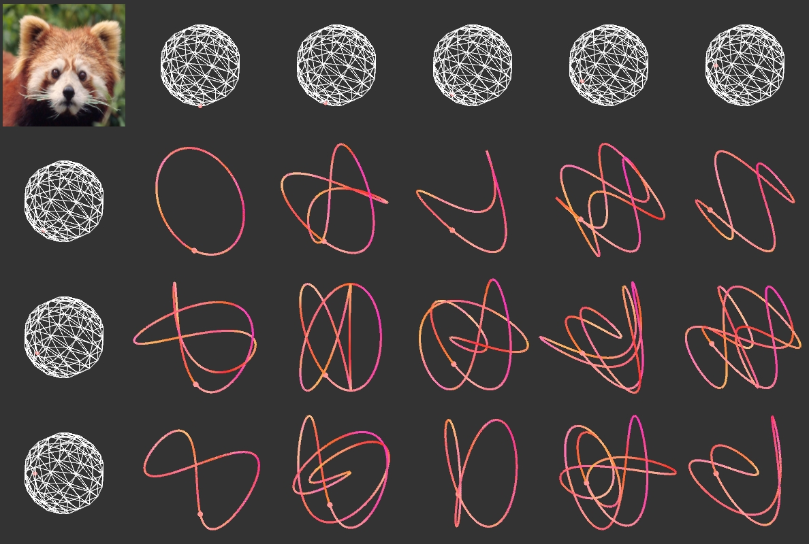

# Processing Projects

This are projects made with the [Processing 3](https://processing.org/) library. Most of them are inspired by the videos of [The Coding Train](https://www.youtube.com/channel/UCvjgXvBlbQiydffZU7m1_aw) channel

## Lemniscate

</img>

## Lissajous curve + Lemniscate

</img>

## Lissajous curve 3D

</img>

